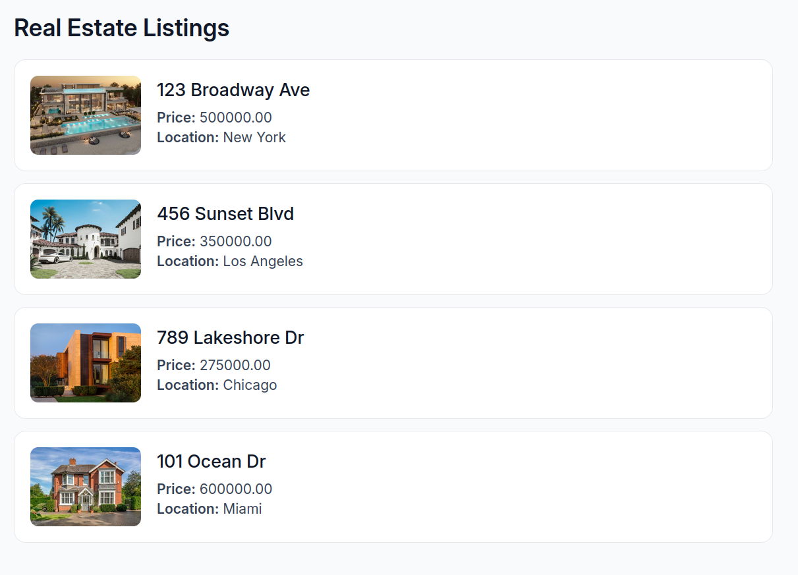
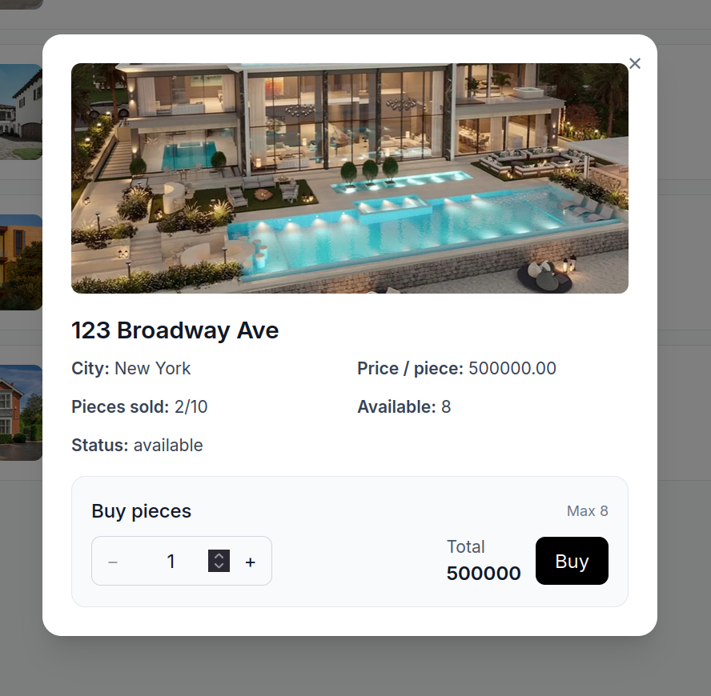
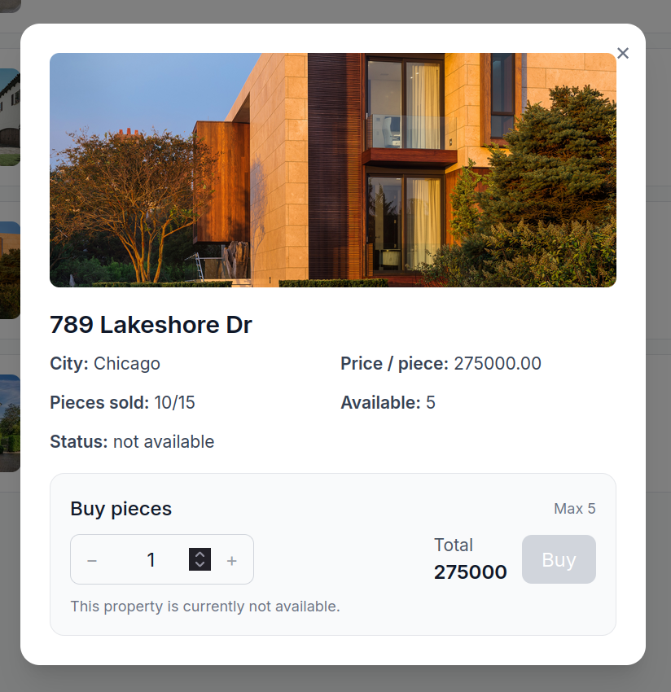

# Order flow

An order flow implementation by Alessio!

## Starting

This project uses Docker Compose! Building and running is as easy as:

```sh
docker compose up -d
```

## Screenshots

<p align="center">
  <figure>
    
    <figcaption><em>Figure 1:</em> Home screen</figcaption>
  </figure>
  <figure>
    
    <figcaption><em>Figure 2:</em> Details modal</figcaption>
  </figure>
  <figure>
    
    <figcaption><em>Figure 3:</em> Unavailable property with disabled buttons</figcaption>
  </figure>
</p>
